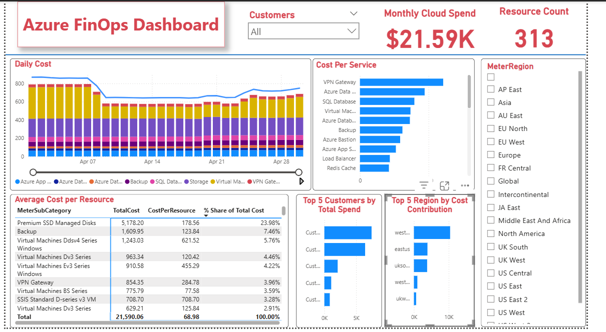

# 💰 Azure FinOps Power BI Dashboard 1.0

## 📘 Overview
This project demonstrates the use of **Power BI** for analyzing and visualizing **Azure cost and usage data** 
The dashboard provides key insights into **service-level spending**, **cost efficiency**, and **regional usage patterns**, enabling organizations to make data-driven decisions around cloud optimization and governance.

> **Note:** The dataset used in this project is a *sample CSP daily rate usage file* created purely for demonstration purposes.  
> All data points are fictional and do not reflect any real customers or organizations.

---

## 🎯 Objectives
The goal of this project is to:
- Show how **FinOps principles** can be applied to Azure cost data.
- Provide visibility into **spending patterns across services, regions, and customers**.
- Identify **high-cost areas** and opportunities for optimization.
- Demonstrate **Power BI modelling and DAX proficiency**.

---

## 🧠 Key Insights From the Dashboard
1. **Top Services by Spend:** Identifies which Azure services (e.g., Virtual Machines, VPN Gateway, Storage) contribute most to total costs.  
2. **Cost per Service:** Calculates cost efficiency by dividing total cost of each service by the number of active resources within that service..  
3. **Daily Cost Trend:** Tracks day-to-day fluctuations to reveal unusual cost spikes.  
4. **Regional Usage:** Highlights which Azure regions drive the most consumption.  
5. **Average Cost per Resource:** Provides a detailed breakdown of services (e.g., VM series) to analyze cost performance by category and determine each category’s percentage of the total cost. 
6. **Customer Spend Analysis:** Shows the top-spending customers for transparency and billing insight.

---
## 🧾 Executive Summary

This **Azure FinOps Power BI Dashboard** provides visibility into service-level spending, regional cost distribution, and customer usage patterns   
It demonstrates how **FinOps principles — visibility, optimization, and accountability —** can be applied to cloud cost governance.

## 🔍 Key Insights

* **Total Spend:** The organization spent approximately **$21.6K** in April across **313 resources**.
* **Regional Contribution:** The **West Europe** region accounts for the largest share, about **48% of total spend**, driven primarily by **Virtual Machines, SQL Databases, Storage, and App Service** workloads.
* **Networking Costs:** **VPN Gateway** shows consistent daily costs and has the **highest cost per service**.
* **Customer Spend:** **Customer_2lsc2Vyd** and **Customer_EVDSE5PT** are the top spenders, together representing **64% of total spend**.

---
## 📊 Dashboard Features
| Feature | Description |
|----------|--------------|
| **Dynamic Filters** | Customer Name and Meter Region slicers for interactive analysis |
| **Drill-down Capability** | Click on a service to see detailed average cost per resource |
| **Responsive Layout** | Optimized for readability with grouped visuals and consistent formatting |
| **KPI Cards** | Summarizes key metrics like total usage and total resources |

---

## 🎨 Visual Layout

This section describes the key visuals used in the dashboard and their purpose.

| Visual Type | Purpose / Insight | Key Fields Used |
|--------------|------------------|-----------------|
| **Card** | **Total Monthly Cost & Total Resource Count** : Displays total Azure spend across all customers and total resources contributing to the spend  | BillingPreTaxTotal & Meter Id |
| **Stacked Bar Chart** |  **Cost per Service**, **Top 5 Customers** & **Top 5 Region by Cost Contribution** : Shows *cost per resource by Meter Category*, *cost distribution by customer* and *cost distribution by region* respectively| CostperResource, MeterCategory, CustomerOrganisation, ResourceLocation |
| **Line and Stacked Column Chart** | **Daily Cost Trend**: The line chart reveals monthly spending trends and potential anomalies, and the stacked column chart breaks down the top eight services driving daily costs for deeper visibility into cost contributors  | BillingPreTax, UsageDate, TotalDailySpend and MeterCategory |
| **Table** | Displays a detailed breakdown by MeterSubCategory, highlighting total cost and cost per resource to identify high-cost service categories | MeterSubCategory, TotalCost, CostPerResource and % Share of Total Cost |
| **Slicer (Filter)** | Enables interactive filtering by Customer and Meter Region | CustomerOrganisation and MeterRegion |

---

## 📸 Screenshots

## 📁 Download the Power BI file

[Click here to download the .pbix file](dashboard/Azure%20FinOps%20Dashboard.pbix)

## 🧰 Tools & Technologies

- Power BI Desktop
- Microsoft Azure Usage Data (CSV Export)
- DAX
- Power Query (Data Cleaning)

